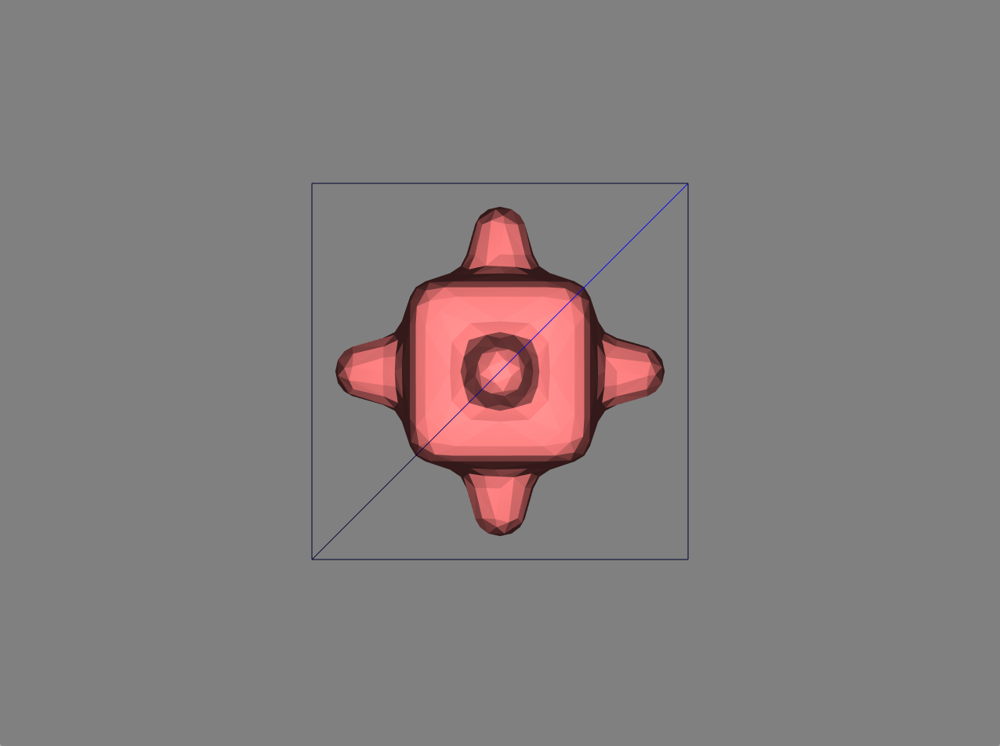
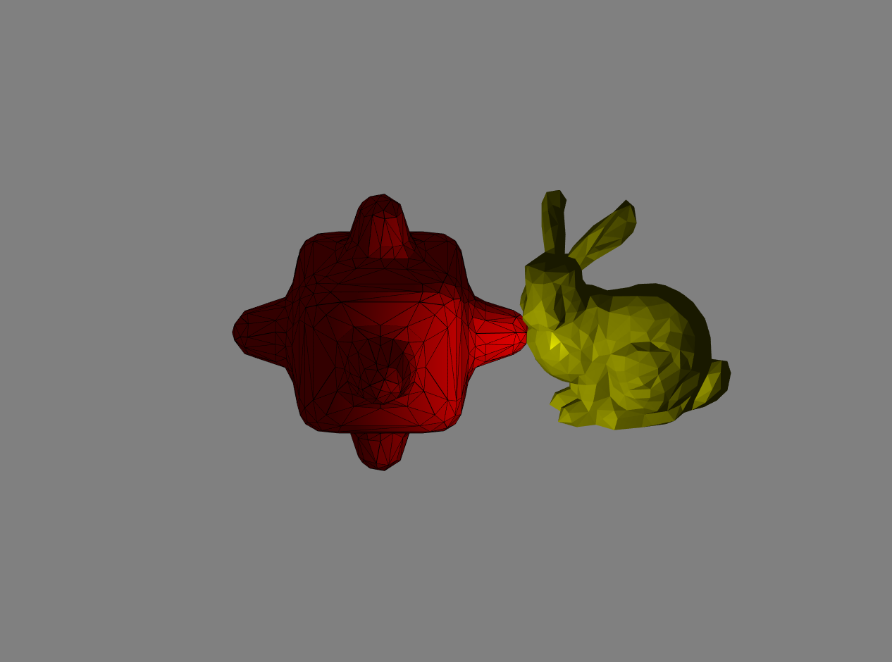

## 3D scene editor

Lynn Li

**<u>Compilation Instruction</u>**

```
cd 3D-Scene-Editor
mkdir build
cd build
cmake -DCMAKE_BUILD_TYPE=Release ../ 
make
```

<u>**Key Control**</u>

**1** Add Cube

**2** Add Bumpy

**3** Add Bunny

**D**  Delete selected object

**T**  Transform right selected object

**CTRL+T** Transform left selected object

**S**  Scale down selected object

**CTRL+S** Scale up selected object

**R**  Rotate selected object

**W**  Wireframe mode of selected object

**P**  Phong shading mode selected object

**F**  Flat shading mode of selected object

**8** Trackball view mode

**9** Perspective view mode

**0** Orthographic view mode

**Up Arrow**  Move camera up

**Down Arrow**  Move camera down

**Left Arrow**  Move camera left

**Right Arrow**  Move camera right

**ESCAPE**  Exie program

<u>**Implementation**</u>

**1.1 Scene Editor** 

1. add ElementBufferObject Class in Helpers.h and add functions in Helpers.cpp

```c++
// Helpers.h
class ElementBufferObject
{
public:
    ...
    // Create a new empty EBO
    void init();
    // Updates the EBO with GLint array
    void update(const Eigen::MatrixXi& elements);
    // Select this EBO for subsequent draw calls
    void bind();
    // Release the id
    void free();
};

// Helpers.cpp
void ElementBufferObject::init(){...}

void ElementBufferObject::bind(){...}

void ElementBufferObject::free(){...}

void ElementBufferObject::update(const Eigen::MatrixXi& elements){...}
```

2. create a off file for cube

3. Initiate 4 VBO for cube, bunny and bumpy cube

   1. VBO contains vertex for each mesh
   2. VBO_N contains normal for each vertex
   3. VBO_F_V contains vertexs on each face, starting at face[0]
   4. VBO_N2 contains normal for vertex on each face

4. Create struct Model

```
struct Model{
  V, F, F_V;
  vertex_num, face_num;
  face_normal, vertex_normal;
  model_enum; //mesh type
  center; //barycenter
       
  Matrix4f trans_mat,scale_mat,rotate_mat,model_mat;
};
```

5. Read each off file to Model cube/ bunny/ bumpy and create a original "prototype" for each mesh. Update all VBO.

```
void load_model(){..}

void read_off_file(string filename, Model &model_instance){...};

void load_VBO(string filename,MatrixXf &V_obj,MatrixXf &V_obj_f_v, MatrixXi &elements_obj){...};
```

7. Initiate three mesh array. Add corresponding mesh to array when 1/2/3 is being pressed

```
void add_object(int object_enum){...};
```





9. Initiate 3 VAO for each type of object. Call VAO, and draw corresponding meshes.

**1.2 Object Control** 

1. When T/S/D/R transformation key being call and there is object is being selected, update selected model's **trans_mat,scale_mat,rotate_mat,model_mat**

```
void translate_model(Model &model, double xlen,double ylen,double zlen){...};

void scale_model(Model &model, double scale){...};

void rotate_model(Model &model,int degree){...};

void delete_model(Model &model){...};
```


2. Change uniform "color" everytime the model is being selected
3. Wireframe mode: use VBO_F_V and VBO_N2, VBO_N2 is calculated with following functions. 
```
// return normal for each vertex and store it in VBO_N2
void vertex_normal(Model &model,MatrixXf &V_N){...};
// return list of faces that relates to certain vertex
list<int> list_of_faces_with_vertex(int index,Model model){...};
// calculate normal for vertex based of list of faces
Vector3d calc_vertex_normal(Model model,list<int> ans){...};

...

glPolygonMode(GL_FRONT_AND_BACK, GL_LINE);
glDrawArrays(GL_TRIANGLES,0,V_cube_f_v.cols());
glPolygonMode(GL_FRONT_AND_BACK, GL_FILL);
```


4. Flat shading mode: use VBO_F_V and VBO_N2

```
glPolygonMode(GL_FRONT_AND_BACK, GL_LINE);
glDrawArrays(GL_TRIANGLES,0,V_cube_f_v.cols());
glPolygonMode(GL_FRONT_AND_BACK, GL_FILL);
glDrawArrays(GL_TRIANGLES,0,V_cube_f_v.cols());
```


5. Phong mode: use VBO and VBO_N. VBO_N is calculated with following functions

```
// return normal for each face and all vertex on same face have same normal. Store each normal in VBO_N
void face_normal(Model &instance,MatrixXf &V_N2){...};

...

glPolygonMode(GL_FRONT_AND_BACK, GL_FILL);
glDrawArrays(GL_TRIANGLES,0,V_cube_f_v.cols());
```


6. Object selection: use view\*model\*each vertex to bring vertex to camera space. use projection.inverse() and bring cursor position to camera space. Then use ray tracing to implement object selection. Since it's in camera space, ray's z is always -1.0.

```
// For each click, call function calculate_cam_position() and on_object()
void mouse_button_callback(GLFWwindow* window, int button, int action, int mods){...};

// Calculate cursor position in camera space
void calculate_cam_position (Vector3d cursor_pos, Vector3f &cur_cam_pos, double width, double height){...};

// for each triangle in each object, call ray_tri_intersect
// return a Vector(model_type, model_index);
Vector2i on_object(Vector3f cur_cam_pos){...};

// determine weather cursor's ray intersect with the triangle
bool ray_tri_intersect(Vector3f ray_origin, Vector3f ray_direction, VectorXf v0,VectorXf v1, VectorXf v2, double &t)
```

**1.3 Camera Control** 

1. Orthographic Camera: 

```
case ortho:
 projection <<
    2/(r-l),0, 0, -(r+l)/(r-l),
    0,2/(t-b), 0, -(t+b)/(t-b),
    0,0,-2/(f-n), -(f+n)/(f-n),
    0,0, 0, 1;
 projection*=proj_multi;
 break;
```

2. Perspective Camera:

```
case pers:
  projection <<
     2*n/(r-l), 0, (r+l)/(r-l),0,
     0,2*n/(t-b), (t+b)/(t-b),0,
     0,0,-(f+n)/(f-n),-2*f*n/(f-n), 
     0,0, -1, 0;
  projection*=proj_multi;
  break;
```


3. Trackball Camera: Update camera position 

```
camX = sin(xchange) * radius;
camY = sin(ychange) * radius;
camZ = cos(xchange)*cos(ychange) * radius;
```




